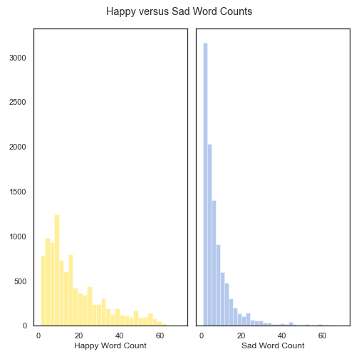

# Natural Language Processing

- [Problem Statement](#Problem-Statement)
- [Description of Data](#Description-of-Data)
- [Model Performance on Training and Test Data](#Model-Performance-on-Training-and-Test-Data)
- [Primary Findings](#Primary-Findings)
- [Next Steps](#Next-Steps)

## Problem Statement

We will use natural language processing to classify Reddit titles form the "happy" and "sad" subreddits. The goal will be to classify the testing data as coming from either the "happy" or "sad" subreddit as accurately as possible.

We will compare the performance of different classification models and use a grid search with cross validation to discover improve the hyper parameters for each model.

## Description of Data

The data was pulled using the Pushshift API (https://github.com/pushshift/api) from the following websites:

- https://www.reddit.com/r/happy/
- https://www.reddit.com/r/sad/

The data used to model was a 20,000 row by 2 column dataframe. The critical column of data here are the titles from posts made to each subreddit. A target column was created by assigning the value 1 to all the rows of the "happy" subreddit and the value 0 to all the rows of the "sad" subreddit.

From each subreddit 10,000 titles were stored into a Pandas dataframe by requesting 100 titles at a time, and then requesting the next 100 titles from posts before the "created_utc" timestamp of the last title in the previous API request.

Cleaning the data was relatively simple as only a simple row had a null value. This row of data was dropped.

Counting the word counts of titles showed that "happy" posts are on average longer than "sad" posts.

- "Happy" posts were approximately 94 words long
- "Sad" posts were approximately 40 words long

The following graphic shows the distribution of the word counts which show that the majority of "sad" posts are very small.

# Model Performance on Training and Test Data

The first thing determined to benchmark our model performance was the baseline accuracy. As half of the data is from "happy" post and hald the data is from "sad" posts the baseline accuracy is almost exactly 0.5. It is slightly in the favor of "happy" posts as a single null entry of data was removed and this was a "sad" entry.

Our data was trained on 5 different models using 2 different vectorizers to process the text of the titles. The Training and Testing Scores of each model are shown below.

|Model|Training Score|Testing Score|
|---|---|---|
|Mutinomial Naive Bayes 1|0.85|0.81|
|Multinomial Naive Bayes 2|0.86|0.81|
|K Nearest Neighbors|0.91|0.64|
|Logistic Regression|0.93|0.86|
|Support Vector Classification|0.99|0.86|
|Random Forest Classifier|1.0|0.82|

A [grid search with cross validation](#https://scikit-learn.org/stable/modules/generated/sklearn.model_selection.GridSearchCV.html) was used to choose the parameters of the models whose values are tabulated, with the vectorizers use to convert our text data for modeling fed into the grid search using a
[pipeline](#https://scikit-learn.org/stable/modules/generated/sklearn.pipeline.Pipeline.html).

Two different vectorizer were used to process the text data from the post titles.

- [Count Vectorizer](https://scikit-learn.org/stable/modules/generated/sklearn.feature_extraction.text.CountVectorizer.html)
- [TF-IDF Vectorizer](https://scikit-learn.org/stable/modules/generated/sklearn.feature_extraction.text.TfidfVectorizer.html)

It appeared that generally the TF-IDF Vectorizer would perform slightly better in initial grid search models. During the modeling process it became the default vectorizer in most of our grid searches.

## Primary Findings

In the end it appears that Support Vector Classification and Logistic Regression performed the best with **only** the vectorized data from the post titles. The confusion matrix of the SVC model is shown below.

Logistic Regression has a similar performance and is less overfit. Both models have False Positives and False Negatives that are relatively balanced. The confusion matrix of the Logistic Regression model is shown below.

It is of note that to find these settings for the performance and speed of the single Logistic Regression model used a **three hour** grid search was implemented. The solver used for the model, the "saga" solver, slowed down the modeling substantially for most of the grid search.

For this reason the final choice in model is the Support Vector Classifier. It has relatively easy hyper parameters to tune for good performance. We were able to substantially surpass our baseline accuracy of 0.5 with a score of 0.86 and that is with **only** the text data.

The KNN Classifier underformed significantly compared to the other models. It was highly overfit with a training accuracy of 0.91 and a testing accuracy of 0.64. We can see in the confusion matrix for the KNN model that False Negatives are significantly more frequent.

In this case that means that our KNN model has an issue accurately identifying the "sad" posts. The model is actually quite good at identfying "happy" posts. If this deficiency could be addressed there is the possibility that KNN could be improved to meet the performance of the other models.

## Next Steps

Exploring adding additional features could assist in improving our accuracy. Just from our initial exploratory data analysis it was shown that happy posts often are longer than sad posts. Some ideas for exploring new features are:

- Are sad posts more often flagged as 18 or over?
- Do happy posts more often have an image attached?
- Do happy or sad posts have a difference in how many comments each post has?

New data would also require some exploration into the performance of the other models with additional data. Are support vector models just as good if additional numerical or categorical  features are included in the data?

There is also an interesting question to look into following this. Can these models be used to classify subreddits that are similar in theme to "happy" or "sad"?

Can we classify posts from https://www.reddit.com/r/MadeMeSmile/ or https://www.reddit.com/r/awfuleverything/ assuming that "MadeMeSmile" would lean more often towards what is classified as "happy" and "awfuleverything" would lean more often towards what is classified as "sad"? This is an excellent question for the next investigation using Natural Language Processing.

Finally, a bigger and much more difficult question is how far can classification methods like this go? Could a model be built that would accurately assign any title to its proper category? This would be a substantially more involved process, but could assist in recommending posts to those who would ready them based on the title.
